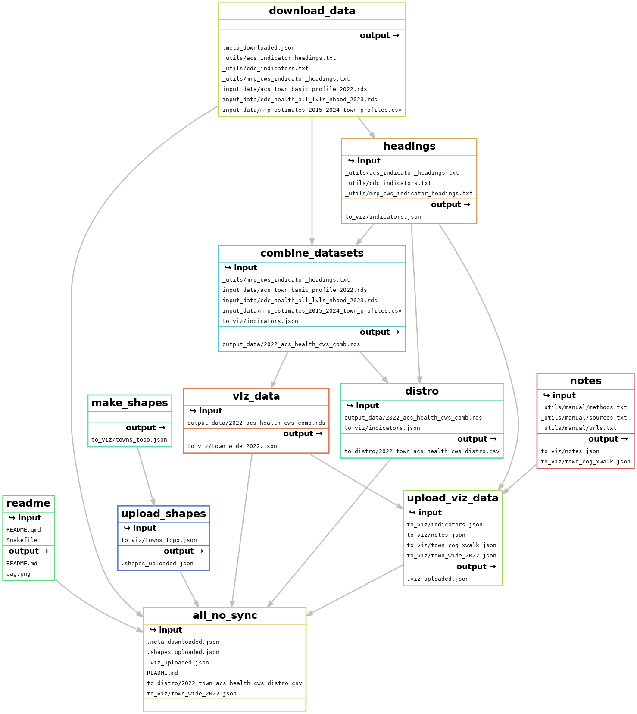

# Data for neighborhood profiles–2022 ACS, 2023 PLACES

# README

Sources for the profile data are the most recent ACS (2022), CDC PLACES
(2023 release), and USALEEP (not updated). There’s no fresh analysis
done in this repo—this is a way to assemble data from other projects
with readable headings and descriptions, and prep it for each city’s
neighborhood profiles and online visualization.

Datasets prepped for download from other repos are in their respective
tagged releases to ensure their stability and reproduceability. Not all
assets from each tag are used, but the files in those releases are:

| repo       | tag                                                                   | updated              | assets                                                                                                                             |
|:-----------|:----------------------------------------------------------------------|:---------------------|:-----------------------------------------------------------------------------------------------------------------------------------|
| 2022acs    | [dist](https://github.com/CT-Data-Haven/2022acs/releases/tag/dist)    | 2024-05-23T19:29:47Z | acs_nhoods_by_city_2022.rds, acs_town_basic_profile_2022.rds                                                                       |
| cdc_aggs   | [v2023](https://github.com/CT-Data-Haven/cdc_aggs/releases/tag/v2023) | 2024-05-23T18:25:57Z | cdc_health_all_lvls_nhood_2023.rds, cdc_health_all_lvls_wide_2023.csv                                                              |
| scratchpad | [meta](https://github.com/CT-Data-Haven/scratchpad/releases/tag/meta) | 2024-05-29T00:12:40Z | acs_headings_extra.txt, acs_indicator_headings.txt, cdc_indicators.txt, cws_indicator_headings.txt, mrp_cws_indicator_headings.txt |

This also creates its own release back into the scratchpad repo with
topojson files of neighborhoods for each city to use for online
visualization:

    title:  Geographies
    tag:    geos
    draft:  false
    prerelease: false
    author: camille-s
    created:    2022-05-11T20:17:57Z
    published:  2024-03-21T20:35:19Z
    url:    https://github.com/CT-Data-Haven/scratchpad/releases/tag/geos
    asset:  all_city_nhoods.rds
    asset:  bridgeport_topo.json
    asset:  hartford_topo.json
    asset:  new_haven_topo.json
    asset:  stamford_topo.json
    --

This uses snakemake to build. Rules available are:

    all
    clean
    combine_datasets
    distro
    download_data
    headings
    make_shapes
    notes
    readme
    sync_to_dw
    upload_shapes
    upload_viz_data
    viz_data

Build process is as follows:

    Building DAG of jobs...

